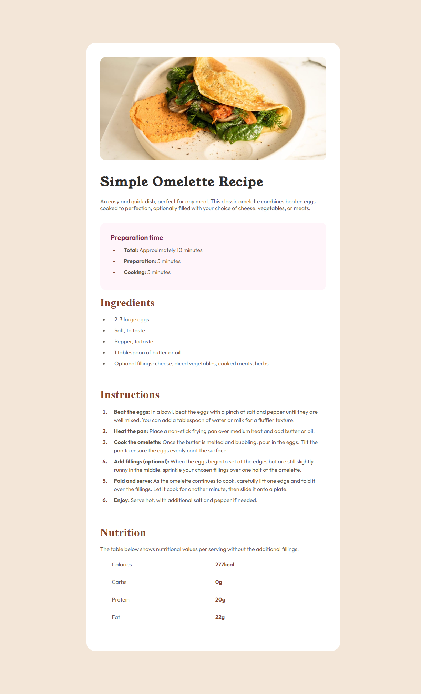

# Frontend Mentor - Solução para o desafio Pagina de receita

Esta é a solução para o [desafio pagina de receita no Frontend Mentor](https://www.frontendmentor.io/challenges/recipe-page-KiTsR8QQKm). Os desafios do Frontend Mentor ajudam você a aprimorar suas habilidades de codificação, construindo projetos realistas. 

## índice

- [Visão Geral](#visão-geral)
  - [Screenshot](#screenshot)
  - [Links](#links)
- [Meu processo](#meu-processo)
  - [Construido com](#construido-com)
- [Autor](#autor)

## Visão Geral

### Screenshot

### Links

- URL da solução: [Recipe Page Challenge Solution](https://your-solution-url.com)
- Live Site URL: [Confira o site ao vivo](https://your-live-site-url.com)

## Meu processo

### Construido com

- Semantic HTML5 markup
- CSS custom properties
- Flexbox
- CSS Grid
- Mobile-first workflow

## Autor

- GitHub - [bisbygui](https://github.com/bitsbygui)
- Frontend Mentor - [@bitsbygui](https://www.frontendmentor.io/profile/bitsbygui)

